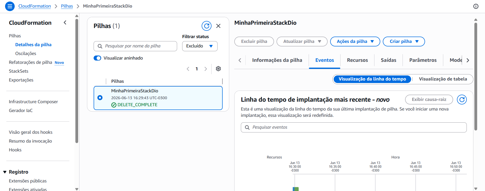

# ☁️ Desafio DIO - Infraestrutura como Código com AWS CloudFormation

Repositório criado para documentar o desafio prático de automação de infraestrutura na AWS utilizando o **CloudFormation**, desenvolvido durante o bootcamp na [DIO](https://www.dio.me/).

---

## 🎯 Objetivo do Projeto
O objetivo deste laboratório foi aplicar na prática os conceitos de Cultura DevOps e Infraestrutura como Código (IaC). Através de um template declarativo, foi possível provisionar e gerenciar recursos na AWS de forma automatizada, segura e padronizada, simulando um cenário real de engenharia de nuvem.

---

## 🛠️ Tecnologias e Conceitos Absorvidos

* **AWS CloudFormation:** Serviço de IaC utilizado para modelar, criar e gerenciar recursos da AWS de forma declarativa via arquivos de configuração.
* **Amazon S3:** Entendimento sobre a segurança e hospedagem de objetos, compreendendo que buckets nascem privados por padrão e exigem configurações explícitas (desativar o *Block Public Access* e criar uma *Bucket Policy*) para se tornarem públicos.
* **Cultura DevOps:** Fixação da mentalidade de colaboração contínua entre equipes de Desenvolvimento (Dev) e Operações (Ops) para acelerar a entrega de softwares com alta qualidade.
* **Ferramentas de Automação:** Diferenciação entre o papel do **AWS CodeDeploy** (focado na implantação automatizada de código em ambientes como EC2, Lambda e Fargate) e ferramentas de IaC como o Terraform, compreendendo a importância de nunca alterar manualmente o arquivo de estado (`.tfstate`).
* **Segurança e Criptografia:** Importância de proteger dados em repouso (KMS) e dados em trânsito (HTTPS/TLS) para blindar credenciais e senhas de usuários contra interceptações na rede.

---

## 🚀 Comprovação Prática (Execução)

Seguindo as boas práticas de DevOps e arquitetura em nuvem, a pilha (*stack*) foi criada com sucesso e, posteriormente, deletada do ambiente para garantir o controle de custos e evitar cobranças desnecessárias na conta AWS.

Abaixo está a evidência visual do console da AWS comprovando o ciclo completo do laboratório com o status de sucesso:

---

## 📁 Como este repositório está organizado

* `README.md` - Documentação completa contendo os objetivos, aprendizados e evidência do projeto.
* `cloudformation-sucesso.png` - Print do console da AWS CloudFormation comprovando a conclusão do desafio com o status `DELETE_COMPLETE`.

---
💡 **Conecte-se comigo no LinkedIn!** [Nicolas Reis](www.linkedin.com/in/nicolas-reis-86a75a31a)
